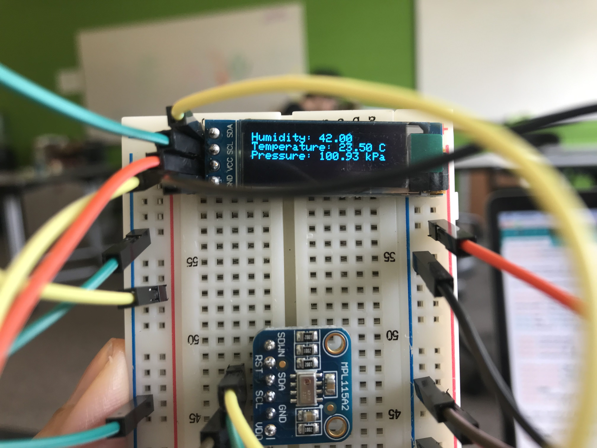

# **Integrating Sensors and Displays**
 Program for collecting humidity and temperature information from DHT22 sensor and barometric pressure from MPL115A2-I2C sensor. The information is displayed on the OLED module.

## __Output__
If you followed all of the instructions, then your output should look a little something like this:

